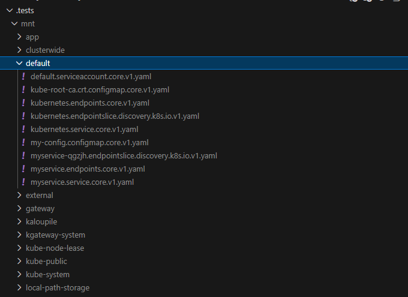

# KubeFS

[](https://golang.org/doc/install)
[](LICENSE)
[](https://goreportcard.com/report/github.com/yyewolf/kubefs)

KubeFS mounts Kubernetes resources as a local filesystem. It turns CRDs and native resources into files you can read, edit, and manage.

## Why this exists

Kubernetes APIs are powerful but not always easy to browse. CRDs in particular are hard to explore when you just want to see what exists and edit a few objects. KubeFS gives you a simple tree that you can navigate with standard tools, and it keeps resources close to your editor.

## What it looks like



## What is possible

- Browse native resources and CRDs as files
- Read and edit YAML in place
- Limit scope to specific namespaces (see [Config](#config))
- Filter by apiGroup and resource type (see [Config](#config))
- Opt in to create and delete resources (see [Config](#config))

## Install

```bash
go install github.com/yyewolf/kubefs@latest
```

## Run

```bash
kubefs /path/to/mountpoint
```

## Config

KubeFS reads a `kubefs.yaml` file from your current working directory by default. You can point to another file with `--config`.

Minimal example:

```yaml
logLevel: info
scope: cluster
showManagedFields: false
```

Scoped example with filters:

```yaml
scope: namespace
namespaces:
  - dev
  - qa

allow:
  - apiGroups: [core, apps]
    resources: [pods, deployments]

deny:
  - apiGroups: ["*"]
    resources: [events]
```

Optional safety flags:

```yaml
allowCreate: true
allowDelete: true
```

## Contributing

Contributions are welcome. If you want to help, please open an issue or a pull request.

Suggested steps:

- Fork the repo
- Create a branch
- Add tests where it makes sense
- Run `go test ./...`
- Open a pull request
